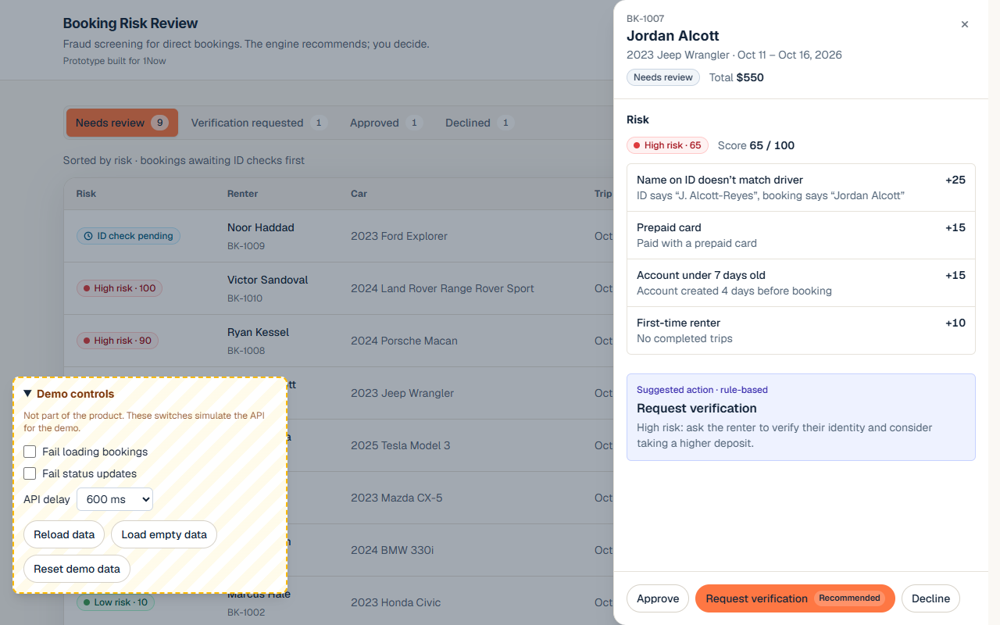

# Booking Risk Review

A fraud-review queue for direct car rental bookings, built as a take-home for 1Now.

**Live demo:** https://1now-booking-risk-review.vercel.app/ · **Walkthrough:** [https://www.loom.com/share/77d2a61112824110bf1327516313784c]

**How I directed Claude Code:** [CLAUDE.md](CLAUDE.md) (rules), [PLAN.md](PLAN.md) (phases), [JOURNEY.md](JOURNEY.md) (what went wrong and how I steered).

## 1. The operator's problem

On Turo, the marketplace screens renters for fraud. An operator who takes bookings directly loses that screening, and one bad renter can cost them a car. They need to know which new bookings deserve a second look, and why, before they hand over the keys.

## 2. What I built

A review queue. Every new direct booking gets a risk score from a rule-based engine, along with the signals behind it and a recommended action. The operator makes the final call: **Approve**, **Request verification** or **Decline** (with a required reason). This mirrors the recommend-then-approve pattern of 1Now's Carisma "Gatekeeper": the system suggests, and the operator decides.



## 3. How it works

The score is the sum of the signals that fire, capped at 100. The tables below are generated from [`risk.config.ts`](src/features/risk-review/lib/risk.config.ts), the single source for every weight and threshold.

| Signal                             | Fires when                                   | Points |
| ---------------------------------- | -------------------------------------------- | -----: |
| ID check failed                    | The ID check came back failed                |    +40 |
| Name on ID doesn’t match driver    | Names differ, ignoring case and extra spaces |    +25 |
| Prepaid card                       | The payment card is prepaid                  |    +15 |
| Account under 7 days old           | Account age at booking time is under 7 days  |    +15 |
| First-time renter                  | 0 past trips                                 |    +10 |
| Pickup under 3 hours after booking | Pickup is under 180 minutes after booking    |    +10 |
| High-value car                     | Daily rate is $150 or more                   |    +10 |
| Trip longer than 14 days           | The trip is longer than 14 days              |     +5 |

Signals are measured against the moment the booking was placed, so a booking's score doesn't drift while it waits in the queue.

| Risk level | Score                                 |
| ---------- | ------------------------------------- |
| Low        | under 30                              |
| Medium     | 30–59                                 |
| High       | 60 or more                            |
| ID pending | not scored until the ID check returns |

**Recommendation rules** (first match wins):

1. ID check pending → **wait for the ID check**. Approve is disabled.
2. ID check failed, or score 85 or more → **decline**.
3. Score 30 or more → **request verification** (and consider a higher deposit when risk is high).
4. Otherwise → **approve**.

A decline always needs a reason of at least 10 characters, not counting leading or trailing spaces. The operator can override any recommendation.

## 4. Assumptions

- Operators approve bookings manually today; 1Now's public site describes approvals in the app.
- ID results arrive asynchronously, so "ID pending" is a real state, not an edge case.
- A recommendation is advice. The operator always decides.

## 5. Run it

Requires Node 20.19+ or 22.12+ (Vite 7's minimum). Developed on Node 26.5.

```bash
npm install
npm run dev        # http://localhost:5173
npm run test:run       # all Vitest tests, single run
npm run test:coverage  # the same, with a coverage report in coverage/
npm run build          # type-check + production build

npx playwright install chromium   # once, before the first E2E run
npm run test:e2e       # Playwright in Chromium, against the production build on port 4173
```

**Demo controls** (bottom-left, dashed amber box; not part of the product):

- **Fail loading bookings:** while ticked, loading fails, showing the error state and Retry.
- **Fail status updates:** while ticked, every decision fails after its optimistic update, so you can see the rollback and the inline error.
- **API delay:** 0, 600 or 2000 ms per request, to show loading and saving states.
- **Reload data:** refetches from the mock server with the current switches, so your decisions stay. After **Load empty data** it keeps returning no bookings until **Reset demo data**.
- **Load empty data:** returns no bookings, showing the empty state, until you reset.
- **Reset demo data:** restores the original 12 bookings and the default switches.

## 6. Decisions and trade-offs

- **Vite + React, not Next.js.** It's one screen with mock data, so routing and a server add nothing. I wanted to stay within code I could change confidently. The components would port directly to Next.js.
- **Rule-based, not AI.** Every point in a score traces back to a named signal, every rule has a unit test, and there's no "AI" label on what is really an `if` statement.
- **Pure logic, one hook, presentational components.** Scoring, recommendations and allowed status changes are pure functions in `lib/`. `useBookings` owns the data and the API calls. Components only render props.
- **Optimistic updates with per-booking rollback.** A decision shows immediately. If the save fails, only that booking rolls back, even when several updates are in flight.
- **The drawer stays open on failure,** so the operator doesn't lose the decline reason they typed. An inline error explains what happened.
- **The drawer closes only via × or Esc.** Outside clicks used to close it and lose the typed reason.
- **1Now's look, adjusted for accessibility.** I used their fonts and colours, but primary buttons have navy text (white on their orange is 2.65:1), the subtle grey is darker to pass 4.5:1, and risk colours stay semantic: red, amber, green, and blue for ID pending.

## 7. What I cut and why

All out of scope for a one-screen prototype:

- **Auth:** there's one operator and no sensitive data.
- **Backend/database:** a mock async API with simulated failures exercises the same states.
- **Real ID verification (Vouched):** the "ID pending" state stands in for its async result.
- **Payments and deposits (Stripe):** the recommendation mentions a higher deposit; taking one is a separate flow.
- **Messaging:** "Request verification" changes the status but doesn't send an SMS or email.
- **Carisma/LLM integration:** it needs 1Now's internal APIs; the rule engine is the piece an agent would call.
- **Next.js routing:** there's only one screen.

## 8. Known limitations

- **Rollback snapshots can restore an older booking over newer data.** Each optimistic update keeps a snapshot of the booking to roll back to. A reload while an update is in flight can put that old snapshot back over freshly loaded data. And two updates to the same booking in the same tick, before React re-renders, aren't refused: if both fail, the screen can end up out of step with the server. The UI can't trigger the second case today, because the buttons disable after the first click; a test pins it (`useBookings.qa.test.ts`, marked `it.fails`).
- No persistence: refreshing the page resets the data.
- Mock data only.
- The Demo controls are mouse-only while the drawer is open.

## 9. Tests

**263 Vitest tests** (unit + React Testing Library in jsdom) and **25 Playwright tests** (real Chromium). One Vitest test is marked `it.fails` on purpose: it pins the known limitation above. [TEST_CASES.md](TEST_CASES.md) maps every spec rule to the test that covers it.

- **Risk engine:** every signal and its edge (for example, 179 vs 180 minutes, $149 vs $150, 14 days vs 14 days + 1 minute), every score threshold (29/30, 59/60, 84/85), the capped score, and the pending ID state.
- **Transitions:** every allowed and blocked status change, in the logic and in the drawer.
- **Rollback:** a failed update rolls back, including two concurrent updates where only the failing one rolls back, and a retry after a failure.
- **Critical UI flows:** open a booking, a decline without a reason (or with only spaces) is blocked, a decline with a reason moves it to Declined, a simulated API failure rolls it back, and the operator can override any recommendation.
- **In the browser (Playwright):** the same flows end to end, keyboard-only operation with visible focus, no horizontal scroll at 360, 768, 800 and 1280px, and the Demo controls never covering the drawer's buttons.

Coverage: 99.2% of lines and 96.9% of branches overall; 100% of lines and branches in `lib/`, 95.9% / 94.3% in `hooks/`. The uncovered branches left are defensive code the UI can't reach.

Vitest runs workers as threads (`pool: 'threads'`): on a low-memory Windows machine with on-access antivirus, forked workers sometimes missed Vitest's fixed 60 s start timeout.

## 10. Next steps

Plug in real ID results, let operators tune the rules, then maintenance scheduling and payout reconciliation.
